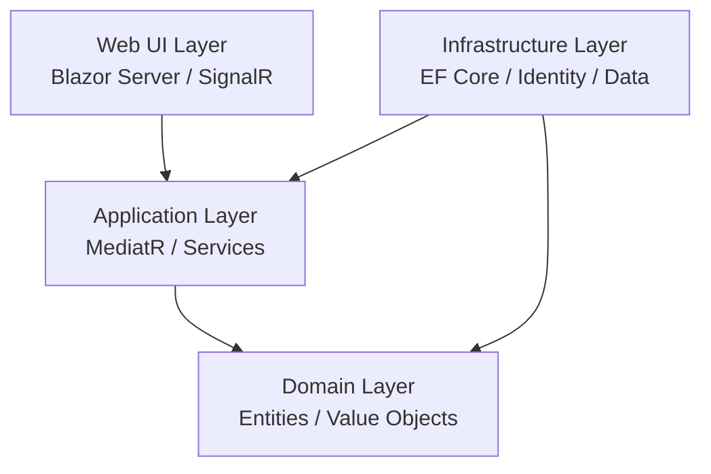

# FlowBoard

FlowBoard is a high-performance, real-time collaborative task orchestration platform built with Blazor 10. It features board-centric workflows, live updates, replay capabilities, and comprehensive workspace analytics within a single, polished shell.

## 🚀 Features

- **Collaborative Kanban Boards:** Drag-and-drop task management with real-time state synchronization.
- **Workspace Analytics Rollup:** High-level metrics aggregating cycle times, workload data, and completion status across all boards.
- **Real-Time Presence & Editing Indicators:** See who is currently viewing the board and which fields they are editing, powered by SignalR.
- **Conflict Resolution:** Graceful handling of concurrent edits.
- **Board Replay Timeline:** Rewind and replay board activity to see how a project evolved over time.
- **Clean Architecture:** Strongly decoupled Domain, Application, Infrastructure, and Web layers.

## 🏗 Architecture

FlowBoard follows a strict Clean Architecture pattern to ensure maintainability and testability:



- **Domain:** Contains the core business entities (`Board`, `TaskItem`, etc.) and exceptions.
- **Application:** Contains business logic, DTOs, and interface definitions for services and data access.
- **Infrastructure:** Implements the interfaces using EF Core (SQLite for Dev, Npgsql for Prod) and ASP.NET Core Identity.
- **Web:** The Blazor Web App providing the interactive UI, API endpoints, and SignalR hubs.

## 🛠 Local Development Setup

To get started with local development, you need the .NET 10 SDK and (optionally) Docker.

### Option 1: .NET CLI (SQLite)

The easiest way to run the application locally is using the built-in SQLite database configured for the `Development` environment.

1. **Clone the repository:**
   ```bash
   git clone <repository-url>
   cd FlowBoard
   ```

2. **Run the application:**
   ```bash
   dotnet run --project src/FlowBoard.Web/FlowBoard.Web.csproj
   ```
   *The database schema will be automatically created on first run if configured, or you can run `dotnet ef database update`.*

### Option 2: Docker Compose (PostgreSQL)

To run the application in an environment that closely mirrors production (using PostgreSQL), use the provided `docker-compose.yml`.

1. **Build and start the containers:**
   ```bash
   docker-compose up --build
   ```

2. **Access the application:**
   Navigate to `http://localhost:8080` in your browser.

## 🚢 Deployment

FlowBoard is designed to be deployed as a containerized application to Google Cloud Run, with Firebase Hosting acting as a reverse proxy/CDN.

See the detailed deployment instructions in [DEPLOYMENT.md](DEPLOYMENT.md).

### Quick Deploy

```bash
gcloud run deploy flowboard \
  --source . \
  --region us-central1 \
  --allow-unauthenticated \
  --project blazor-5c3d4
```

## 📸 Screenshots

### Workspace Analytics

*Aggregate insights across all boards in your workspace.*

### Live Kanban Board

*Real-time collaborative task management with presence indicators.*

---
*Built with ❤️ using Blazor 10 and ASP.NET Core.*
